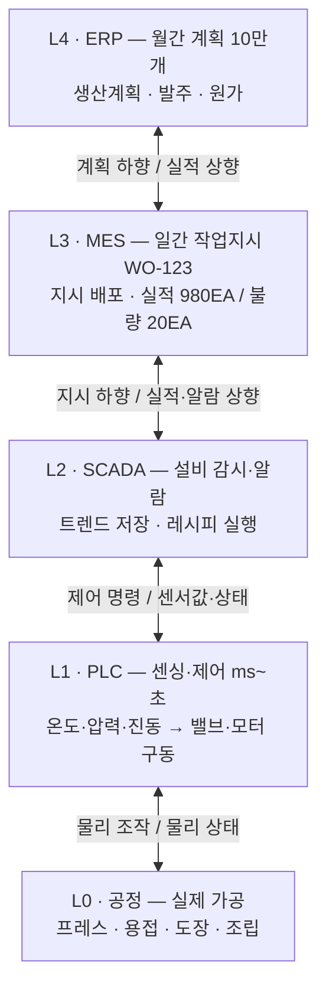

# ISA-95 제조 시스템 계층구조

> [!summary] 한 줄 정의
> ERP(경영)부터 MES(운영), PLC/SCADA(제어), 실제 공정까지. 시스템 간 단절을 없애기 위한 제조업 표준 인터페이스 모델. (ANSI/ISA-95 · IEC 62264)

| 항목 | 내용 |
| --- | --- |
| 목적 | L3–L4 연동 표준화 (ERP↔MES 데이터 교환 규격) |
| 기반 모델 | Purdue Reference Model (Level 0~4) |
| 교환 포맷 | B2MML (ISA-95 기반 XML 스키마) |

---

## 1. 전체 계층 요약 (Level 0~4)

| 레벨 | 명칭 / 시스템 | 시간 주기 | 역할 |
| --- | --- | --- | --- |
| L4 | 경영 계획 (ERP·SCM·PLM) | 월 / 주 / 일 | 생산계획, 주문, 자재·인사·재무·원가 관리 |
| L3 | 제조 운영 MOM/MES (MES·WMS·QMS·EAM) | 일 / 교대 / 시간 | 작업지시, 실적집계, 품질·설비·자재 운영 |
| L2 | 감시·감독 제어 (SCADA·DCS·HMI) | 초 / 분 | 복수 설비 감시, 레시피 실행, 알람·트렌드 |
| L1 | 기본 제어 (PLC·RTU) | ms ~ 초 | 센싱·연동제어·PID, 모터/밸브/로봇 구동 |
| L0 | 물리 공정 | 실시간 | 절삭·용접·도장·성형 등 실제 물질 변환 |

> [!note] 핵심 구간
> ISA-95가 가장 상세히 규정하는 범위는 L4–L3 경계(계획↔운영)와 L3 내부 기능이다. L0–L2는 ISA-88(배치 제어), ISA-101(HMI 설계)과 함께 참조한다.

---

## 2. 레벨별 상세

### L4 · Business Planning and Logistics (경영)
- 시스템: ERP / SCM / PLM · 주기: 월·주·일
- 월간 생산계획, 고객주문·발주, 재고·원가·인사 관리. 현장과 직접 통신하지 않고 L3를 통해서만 지시 전달.
- 예: 다음달 프레스 부품 10만개 생산 계획 확정 후 MES로 전달

### L3 · Manufacturing Operations Management (운영)
- 시스템: MES / WMS / QMS / EAM · 주기: 일·교대·시간
- 작업지시 생성·배포, 실적/불량 집계, 품질·보전·자재 운영. ISA-95 Part 3의 정의 대상.
- 예: 작업지시 WO-123 → 프레스 1라인 배정 → 실적 980EA / 불량 20EA 집계

### L2 · Supervisory Control (감시)
- 시스템: SCADA / DCS / HMI · 주기: 초·분
- 여러 PLC 통합 감시. 레시피 다운로드, 알람 처리, 트렌드 저장.
- 예: 라인별 금형 온도 트렌드 감시, 이상 시 알람 발생

### L1 · Basic Control (제어)
- 시스템: PLC / RTU / 센서·액추에이터 · 주기: ms~초
- 센서값 읽기, 시퀀스·연동·PID 제어, 모터/밸브/실린더 구동.
- 예: 온도 180도 초과 시 냉각밸브 개방

### L0 · Physical Process (공정)
- 절삭·프레스·용접·도장·조립 등 물리적 변환이 일어나는 곳.
- 예: 코일 → 프레스 성형 → 패널 완성

---

## 3. L3 제조운영 4대 기능 (MOM)

ISA-95 Part 3 정의. MES 선정·구축 시 체크리스트로 사용.

- [ ] **생산 운영 (Production)**: 작업지시 생성·배포·변경, 실적·비가동·원자재 투입 집계, 작업자·설비 배정
- [ ] **품질 운영 (Quality)**: 검사 규격·샘플링 관리, SPC, 불량·클레임 처리, 측정장비 교정 관리
- [ ] **보전 운영 (Maintenance)**: 예방·예지보전 계획, 고장 접수·수리 이력, 예비부품 관리
- [ ] **자재 운영 (Inventory)**: 입출고·재고·로트 추적, 창고(WMS) 연동, 자재 불출·반납 관리

---

## 4. 설비 계층 모델 (Equipment Hierarchy)

ISA-95 Part 1. "어디서 생산됐는가"를 식별하는 기준. AI 데이터 태깅(`site` / `line` / `equipment_id`)의 근거.

```
Enterprise ........... 기업 (예: 한빛제조)
  └─ Site ............... 공장 (예: 울산공장)
       └─ Area ............. 구역 (예: 프레스동)
            └─ Process Cell / Production Line ... 라인 (예: 프레스 1라인)
                 └─ Unit / Work Cell ............ 설비 (예: 3번 프레스기)
                      └─ Equipment Module ...... 모듈 (예: 서보모터, 금형, 센서)
```

> [!tip] 실무 포인트
> 설비 명명 규칙을 이 계층에 맞춰 설계한다. 예: `US-PRS-L01-E03` = 울산공장-프레스동-1라인-3호기. 이후 모든 실적·품질·센서 데이터의 공통 키가 된다.

---

## 5. 정보 흐름 (하향 지시 / 상향 집계)

계획은 위에서 아래로 내려가고, 실적은 아래에서 위로 올라간다.



---

## 6. 제조 AI 관점에서의 활용

### 데이터 출처 구분

| 구분 | 출처 레벨 | 데이터 예시 | AI 활용 |
| --- | --- | --- | --- |
| 시계열 | L1 / L2 | 온도·압력·진동·전류 (ms~초 단위) | 이상감지, 예지보전, 품질예측 |
| 운영 | L3 | 작업지시·실적·불량·비가동·교체이력 | 불량원인 분석, 스케줄링, 수율 예측 |
| 계획 | L4 | 수주·생산계획·발주·원가 | 수요예측, 생산계획 최적화 |

### 실무 원칙 3가지

1. **L3 없는 AI는 파일럿용.** 양산 적용은 반드시 MES(L3)를 경유해 지시·실적과 정합성을 맞춘다.
2. **공통 키를 먼저 잡는다.** 설비계층 + 작업지시번호 + 로트 + 시간 4개를 모든 데이터에 붙인다.
3. **교환 포맷은 B2MML.** ERP-MES 연동 시 임의 JSON 대신 ISA-95 기반 B2MML 스키마를 우선 검토한다.

> [!quote] 한 줄 요약
> L0–L2는 제어(Control), L3은 운영(Operation), L4는 경영(Business)을 담당하며, ISA-95는 특히 L3–L4 사이의 언어를 표준화한 것이다.

---

## 7. 용어 정리

| 용어 | 설명 |
| --- | --- |
| ISA-95 / IEC 62264 | 전사-제어시스템 통합 표준. Part 1(모델·용어)부터 Part 8까지 총 8개 Part로 구성 |
| MES / MOM | 제조실행/제조운영 시스템. L3의 대표 시스템 (ISA-95에서는 MOM으로 총칭) |
| B2MML | Business To Manufacturing Markup Language. ISA-95 모델의 XML 구현체 |
| Purdue Model | ISA-95 계층의 원형이 된 참조 아키텍처 (Level 0~4 + DMZ 개념 포함 시 ISA-99/IEC 62443과 연계) |
| ISA-88 | 배치 제어 표준. L2–L3의 레시피·배치 절차 정의 시 함께 사용 |

---

## 관련 노트
- 실습 자료: `실습/1. 과정 개요와 12 시간 운영계획.txt`, `실습/핵심 교육 철학.txt`
- 교재 스터디: [[04 - ISA-95 계층구조]]
