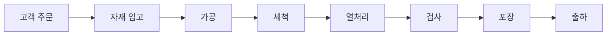

# 02 - 한빛부품 사례와 7대 문제

> [!info] 이 파일에서 배우는 것
> - 전 과정에서 쓰는 가상 기업 한빛부품의 공정·데이터 흐름
> - 현장의 7대 문제와 해결 방향·KPI
> - "하나만 먼저 해결한다면?" 우선순위 판단 기준

> [!tip] 30초 요약
> 한빛부품은 산업용 금속부품을 만드는 가상 기업이다. 주문 하나가 출하까지 가는 동안 생기는 7가지 문제를, 어느 활동과 시스템이 해결하는지 따라가는 것이 이 과정의 전부다.

## 1. 공정 흐름

| 공정 | 핵심 업무 | 대표 시스템 | 주요 데이터 |
| :--- | :--- | :--- | :--- |
| 고객 주문 | 수량·납기 접수 | ERP/SCM | order_id, 요구납기 |
| 자재 입고 | 로트·수량·위치·품질상태 확인 | ERP/WMS/QMS | material_lot, 위치, 상태 |
| 가공 | 절삭·성형·생산실적 | PLC/MES/POP | 수량·시간·정지·설비 |
| 세척 | 조건 적용·완료 확인 | MES/현장제어 | 시간·농도·온도 |
| 열처리 | 온도·유량 제어와 이력 | DCS/MES | 온도·유량 추이·알람 |
| 검사 | 측정·판정·부적합 처리 | QMS/MES | 측정값·판정·불량코드 |
| 포장 | 라벨·포장수량 | PLC/WMS | 완제품로트·라벨 |
| 출하 | 출고·납품·매출 | WMS/ERP | 출하수량·시각·매출실적 |

## 2. 문제로 시작하는 한빛부품의 하루

> [!note] 월요일 오전 9시 (시나리오)
> 고객이 "제품 1,000개를 언제 받을 수 있나요?"라고 묻는다. 영업사원은 전산 재고를 보지만 실제 위치, 품질보류, 타 주문 예약 여부를 즉시 알 수 없다. 생산관리자는 어제 실적을 전화로 확인하고 작업자는 종이 작업일보를 찾는다. 가공현장에서는 변경 전 도면이 사용되고, 검사에서 불량이 발견되지만 자재와 설비 이력을 바로 추적하기 어렵다. 오후에는 설비가 갑자기 멈추고 관리자는 여러 엑셀 파일을 모아 보고서를 다시 작성한다.

## 3. 일곱 문제와 해결방향

| 문제 | 현장 모습 | 해결 방향 | 대표 KPI |
| :--- | :--- | :--- | :--- |
| 납기 확인 지연 | 여러 부서에 전화 후 답변 | 주문·가용재고·구매예정·부하 연결 | 납기 응답시간, 준수율 |
| 구 도면 사용 | A판이 남아 B판 생산에 혼용 | PLM 최신판·적용로트를 MES/QMS에 반영 | 구도면 건수, 반영시간 |
| 종이 실적 | 작업일보 후 엑셀 재입력 | PLC/POP 자동수집 + 사람입력 + MES 확정 | 입력지연, 누락·중복률 |
| 불량 추적 곤란 | 자재·설비·조건을 한 번에 못 찾음 | lot-work order-equipment-result 연결 | 추적시간, 성공률 |
| 고장 후 정비 | 멈춘 뒤에 점검·부품검색 | 상태감시 + CMMS 작업지시·이력 | 비계획정지, MTTR |
| 재고 활용 곤란 | 수량은 있지만 위치·상태·예약 불명 | WMS/QMS/ERP/MES 상태 공유 | 재고정확도, 피킹시간 |
| 보고서 장시간 | 파일 수작업 병합 | 공통 기준정보·자동집계 + 사람 해석 | 작성시간, 수정횟수 |

## 실습 프롬프트

> [!example]- 일곱 문제 중 하나만 먼저 해결한다면? (클릭해서 펼치기)
> 한빛부품의 일곱 문제 중 하나만 먼저 해결한다면 무엇을 선택해야 할까요? 선택 이유 2개, 판단에 필요한 데이터 4개, 관련 담당자 3명을 표로 작성하세요. 정확한 효과 수치가 주어지지 않았으므로 개선율은 만들지 마세요. 마지막에 "추가로 확인할 정보"를 3개 제시하세요.

> [!info]- 강사 해설 포인트
> 정답은 하나가 아니다. 중요한 것은 "문제가 크다"는 주장보다 납기·품질·정지·재고 같은 업무 영향과 데이터 확보 가능성을 근거로 우선순위를 설명하는 것이다.

## 확인 문제

> [!question]- Q1. 납기 확인 지연 문제에서 "전산 재고"만 보면 안 되는 이유는?
> 전산 수량에는 다른 주문에 예약된 수량과 품질보류 수량이 섞여 있어, 실제 출고 가능한 수량(사용가능재고)과 다르기 때문이다.

> [!question]- Q2. 7대 문제를 고를 때 판단 근거로 쓸 두 가지 축은?
> ① 업무 영향(납기·품질·정지·재고) ② 데이터 확보 가능성.

> [!quote] 면접 포인트
> 문제를 말할 때 반드시 "누구의 어떤 업무가 왜 어려운가"까지 붙여서 말한다.

---

**이전:** [[01 - 실습 방법과 AI 검증]] · **다음:** [[03 - DX 목표]] · **허브:** [[00 - 학습 로드맵]]
