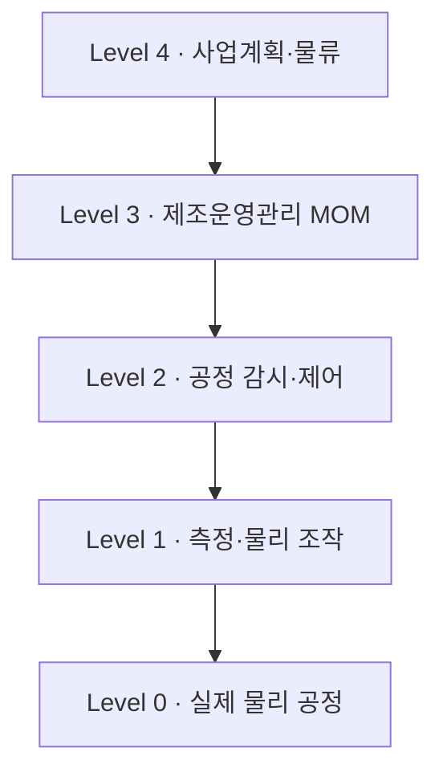

# 04 - ISA-95 계층구조

> [!info] 이 파일에서 배우는 것
> - Level 0~4를 소프트웨어 제품명이 아니라 **활동·책임·시간축**으로 구분한다
> - 하향 계획/기준 정보와 상향 실적/상태 정보를 구분한다
> - 추적성을 만드는 핵심 식별키 체인을 이해한다

> [!tip] 30초 요약
> ISA-95는 기업(Level 4)과 제조(Level 0~3) 사이의 정보 교환을 활동 기준으로 표준화한 틀이다. 제품명(ERP·MES)과 계층을 1대1로 외우면 안 된다.

## 1. 계층 구조



계획·기준은 아래로, 실적·상태는 위로 움직인다.

| Level | 무엇을 다루는가 | 한빛부품 예시 | 시간범위 |
| :--- | :--- | :--- | :--- |
| 4 | 사업계획·물류·전사자원 | 고객주문, 납기, 구매, 재고, 원가 | 일~주~월 |
| 3 | 제조운영관리(MOM) | 작업지시, 일정, 품질, 정비, 재고운영 | 분~시간~교대 |
| 2 | 공정 감시·제어 | 열처리 온도제어, 설비 상태감시 | 초~분 |
| 1 | 측정·물리 조작 | 센서 측정, 밸브·모터 작동 | ms~초 |
| 0 | 실제 물리적 공정 | 절삭, 세척, 가열, 포장 | 물리현상 |

> [!warning] 중요한 오개념 교정
> "ERP=Level 4, MES=Level 3, PLC=Level 2"라고 외우면 실제 프로젝트에서 문제가 생긴다. ISA-95는 활동과 정보교환의 논리적 틀이다. 제품 하나가 여러 레벨의 업무를 지원할 수 있다.

## 2. 주문→출하 관통

| 단계 | 주요 Level | 활동 | 핵심 데이터 |
| :--- | :--- | :--- | :--- |
| 주문·납기 | 4 | 고객 요구, 수주, 가용재고·공급 검토 | order_id, product_id, qty, due_date |
| 설계기준 | 4~3 | 도면·BOM·검사기준·적용판 확정 | revision, BOM, effectivity |
| 구매·입고 | 4~3 | 발주, 입고위치, 품질상태 | PO, material_lot, location, status |
| 계획·작업지시 | 3 | 설비/작업자/공정순서/투입로트 배정 | work_order_id, routing, equipment |
| 공정실행 | 2~0 | 제어·측정·작동·물리변화 | timestamp, tag, value, alarm |
| 검사 | 3 | 측정·판정·부적합·추적 | inspection_id, result, defect_code |
| 포장·출하 | 3~4 | 완제품 위치, 출하, 매출 | finished_lot, shipment_id |

## 3. 핵심 식별키 (추적성 연결축)

```
order_id → work_order_id → material_lot → equipment_id → inspection_id → finished_lot → shipment_id
```

> [!tip] 각 키의 생성 시점·연결 업무·잘못 연결 시 생기는 문제를 설명할 수 있어야 한다.

## 실습 프롬프트

> [!example]- 사건을 Level로 분류하기 (클릭해서 펼치기)
> 한빛부품에서 다음 사건을 ISA-95 Level 0~4의 활동에 연결하세요. A. 고객 주문과 납기를 검토합니다. B. 오늘 생산할 작업을 설비별로 배정합니다. C. 열처리로의 온도를 설정값에 맞춰 제어합니다. D. 온도센서가 값을 측정합니다. E. 밸브가 열립니다. F. 금속 제품이 실제로 가열되어 물성이 변합니다. G. 검사결과를 작업지시와 로트에 연결합니다. H. 생산실적을 ERP에 보고합니다. 계층, 사건, 담당 역할, 주고받는 정보, 판단 이유로 표를 작성하세요. 소프트웨어 이름만으로 계층을 단정하지 마세요.

> [!example]- 개발직무 확장 — 식별키 관계 (클릭해서 펼치기)
> 다음 식별키를 사용해 한빛부품의 추적성 데이터 관계를 설명하세요: order_id, product_id, work_order_id, material_lot, equipment_id, inspection_id, finished_lot, shipment_id. 각 키의 생성 시점, 연결되는 업무, 잘못 연결되었을 때 생기는 문제를 표로 작성하세요.

## 확인 문제

> [!question]- Q1. 위 실습 A~H 사건을 Level에 연결하면? (먼저 스스로 답한 뒤 펼치기)
> | 사건 | Level | 활동 |
> | :--- | :--- | :--- |
> | A 주문·납기 검토 | 4 | 사업계획·물류 |
> | B 작업 배정 | 3 | 제조운영관리(일정·배정) |
> | C 온도 설정값 제어 | 2 | 감시·감독 제어 |
> | D 온도센서 측정 | 1 | 측정 |
> | E 밸브 열림 | 1 | 물리 조작 |
> | F 금속 가열·물성 변화 | 0 | 물리적 공정 |
> | G 검사결과-로트 연결 | 3 | 품질 운영·추적 |
> | H 실적 ERP 보고 | 3→4 | 실적 전달 |

> [!question]- Q2. Level 3은 왜 MES 제품 하나와 같지 않은가?
> Level 3는 생산·품질·정비·재고 운영활동 전체를 포함하는 논리적 범위다. MES는 그 일부를 지원하는 제품일 뿐이며, 회사·구축 범위에 따라 역할이 다르다.

> [!question]- Q3. Level 0과 Level 1의 차이를 "가열"로 설명하면?
> 가열은 실제 물성이 바뀌는 물리 공정(Level 0), 온도센서 측정은 상태를 읽는 것(Level 1).

> [!quote] 강사 확인 질문
> PLM 변경정보가 MES/QMS로 직접 공유되는 경우에도 ISA-95 관점이 유지되는 이유를 설명할 수 있는가? (활동·책임 기준이 유지되면 전달 경로는 회사마다 달라도 된다)

---

**이전:** [[03 - DX 목표]] · **다음:** [[05 - ERP와 SCM]] · **허브:** [[00 - 학습 로드맵]]
