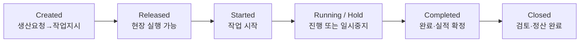

# 07 - MES와 POP

> [!info] 이 파일에서 배우는 것
> - POP(현장 데이터 수집 접점)와 MES(작업지시 중심 실행관리)의 구분
> - 자동수집과 사람입력 항목의 구분
> - "누적 카운터 증가 = 양품 실적"이 아닌 이유

> [!tip] 30초 요약
> 수집(Collection)과 실적 확정(Completed)은 다르다. MES는 수집된 이벤트를 작업지시·로트에 연결해 검증한 뒤 실적으로 확정한다.

## 1. MOM 7가지 기능

| 기능 | 질문 | 한빛부품 예 |
| :--- | :--- | :--- |
| Definition | 무엇을 어떻게 만들 것인가 | 제품·공정경로·표준·작업방법 |
| Resource | 무엇으로 만들 것인가 | 설비·작업자·자재·도구 |
| Scheduling | 언제 만들 것인가 | 교대/설비별 일정 |
| Dispatch | 지금 무엇을 해야 하는가 | 현장 작업우선순위 |
| Collection | 무슨 일이 일어났는가 | 수량·시간·정지·불량 |
| Tracking | 어떤 로트와 설비였는가 | lot-work order-equipment |
| Performance | 계획 대비 결과는 어떠한가 | 달성률·정지·Cycle time |

## 2. Work Order 상태

| 상태 | 의미 | 대표 이벤트 |
| :--- | :--- | :--- |
| Created | 생산요청이 작업지시로 생성됨 | order→work order |
| Released | 현장 실행 가능 상태 | release |
| Started | 실제 작업 시작 | start_time, operator |
| Running/Hold | 진행 또는 일시중지 | count, downtime |
| Completed | 완료·실적 확정 | good, scrap, end_time |
| Closed | 후속 검토·정산 완료 | material consumption, report |

## 3. POP의 역할과 자동/수동 구분

- POP(Point of Production): 현장에서 작업·실적·정지 정보를 수집하는 접점
- 자동수집(PLC/센서): 수량, 시간, 정지 발생
- 사람입력/확인: 정지 사유, 작업자, 판정, 예외
- POP와 MES는 별도 시스템일 수도, 한 제품에 통합될 수도 있다

> [!warning] 누적 카운터 500 증가 ≠ 양품 500
> ① 시험가동 수량이 섞였을 수 있다 ② 재작업품이 다시 카운트될 수 있다 ③ 불량/양품을 센서가 구분하지 못할 수 있다 ④ 카운터 리셋이 발생할 수 있다 ⑤ 어느 work_order_id의 이벤트인지 연결되지 않았을 수 있다.

## 실습 프롬프트

> [!example]- 자동수집과 사람입력 분리 (클릭해서 펼치기)
> 한빛부품 작업자는 작업 시작·종료, 생산수량, 불량수량, 설비정지 사유를 종이에 기록하고 관리자는 퇴근 전에 엑셀로 취합합니다. 1) POP가 수집할 항목을 제시하세요. 2) PLC/센서에서 자동수집 가능한 항목과 사람이 입력/확인할 항목을 구분하세요. 3) MES가 수집정보로 수행할 생산관리 업무를 설명하세요. 4) 데이터 누락·중복을 확인할 방법을 제안하세요. POP와 MES가 별도 시스템일 수도 있고 하나의 제품에 통합될 수도 있음을 설명하세요.

> [!example]- 개발직무 확장 — MES 이벤트 JSON (클릭해서 펼치기)
> 한빛부품 MES Mini의 교육용 생산 이벤트 JSON을 설계하세요. 필드는 event_id, work_order_id, equipment_id, event_type, event_time, good_qty, scrap_qty, downtime_code, operator_id만 사용하세요. START, GOOD, SCRAP, DOWNTIME, COMPLETE 이벤트 예시를 각각 1개씩 보여주고, 중복 이벤트를 막기 위해 어떤 키와 검증이 필요한지 설명하세요.

## 확인 문제

> [!question]- Q1. 부록 B-2 이벤트에서 E003 (09:42, DOWNTIME, code=TOOL)이 의미하는 것은?
> WO-0918-01 작업이 M03 설비에서 진행 중, 09:42에 공구(TOOL) 사유로 정지가 발생했다는 것. 정지 사유는 센서가 아닌 사람/코드로 분류된 정보라는 점이 핵심이다.

> [!question]- Q2. 같은 데이터에서 COMPLETE의 수량 293을 양품으로 그냥 확정하면 안 되는 이유는?
> 그 전에 GOOD 120과 SCRAP 7 등 개별 이벤트가 있고, 아직 검사(QMS) 판정 전일 수 있기 때문. MES가 이벤트를 집계·검증한 뒤 실적을 확정한다.

> [!question]- Q3. MES가 밀리초 제어를 직접 수행한다는 오해가 왜 위험한가?
> 실시간 제어는 PLC/DCS(Level 1~2)의 역할이다. MES는 실행관리(Level 3)이므로 역할 경계를 혼동하면 시스템 설계가 틀어진다.

> [!quote] 면접 포인트
> "수집 항목 중 무엇이 자동이고 무엇이 사람 입력인가"를 사례로 설명할 수 있어야 한다.

---

**이전:** [[06 - PLM]] · **다음:** [[08 - QMS]] · **허브:** [[00 - 학습 로드맵]]
