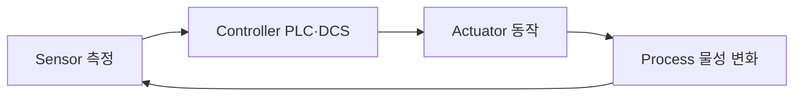

# 11 - 제어계층 (PLC·DCS)

> [!info] 이 파일에서 배우는 것
> - 센서-제어기-구동기-공정의 폐루프를 설명한다
> - PLC와 DCS를 "단순/복잡"이 아니라 공정특성·규모·운전방식으로 비교한다
> - AI 권고와 실제 제어의 안전·책임 경계를 구분한다

> [!tip] 30초 요약
> 측정(Sensor) → 판단(Controller) → 작동(Actuator) → 변화(Process) → 재측정(Feedback)의 폐루프가 기본이다. AI는 제안까지, 실제 제어는 승인된 로직·권한·인터록 안에서만.

## 1. 폐루프: 측정 → 판단 → 작동 → 재측정

| 구성 | 무엇을 하는가 | 열처리 예 |
| :--- | :--- | :--- |
| Sensor | 현재 상태를 측정 | 온도, 유량, 압력 |
| Controller (PLC/DCS) | 설정값·로직·인터록으로 명령 생성 | 밸브 개도 명령 |
| Actuator | 명령을 물리 동작으로 | 밸브/모터/히터 동작 |
| Process | 실제 공정상태 변화 | 로 온도·재료 물성 변화 |
| Feedback | 변화된 상태 재측정 | 센서 값 갱신 |

## 2. PLC와 DCS 비교

| 관점 | PLC 대표 특성 | DCS 대표 특성 | 주의 |
| :--- | :--- | :--- | :--- |
| 주요 사용 | 기계·라인·순차/인터록/모션 | 연속공정·다수 제어루프·운전감시 | 현대 제품은 기능 중첩 |
| 한빛부품 가정 | 가공기·포장기 | 열처리·유틸리티 | 수업용 가정 |
| 선정기준 | 응답성, 기계제어, I/O 구조 | 운전통합, 제어루프, 알람/이력 | 안전·규모·기존구조 포함 |

> [!warning] "PLC는 단순, DCS는 복잡"은 틀린 설명
> 공정특성·규모·운전방식으로 비교한다. 안전제어 코드는 임의로 만들지 않는다.

## 실습 프롬프트

> [!example]- 열처리 제어루프 설명 (클릭해서 펼치기)
> 한빛부품 열처리 구역에서 온도센서가 현재 온도를 측정하고, 제어기가 설정값과 비교하여 연료 조절밸브의 개도를 조정합니다. Sensor, 제어기, Actuator, 실제 공정을 구분하여 정보와 동작의 흐름을 설명하세요. 이어 PLC와 DCS의 대표적 사용 특성을 비교하되 "PLC는 단순, DCS는 복잡"이라고만 설명하지 마세요. 실제 운전 설정값이나 현장 제어코드는 만들지 말고 교육용 개념만 설명하세요.

> [!example]- 개발직무 확장 — Tag List (클릭해서 펼치기)
> 열처리 공정의 교육용 Tag List를 만들어 주세요. tag_id, equipment_id, tag_type(sensor/setpoint/output/alarm), engineering_unit, sample_rate_category, historian_required, mes_context_required 필드만 사용하세요. 실제 제어값 대신 "예시"라고 표시하고, 안전제어 태그는 임의 설정하지 않는다고 명시하세요.

> [!warning] 안전 경계
> AI가 에너지 절감이나 조건 변경을 제안할 수는 있지만, 실제 제어는 승인된 제어로직, 작업자 권한, 인터록, 안전기능을 우회하지 않는 범위에서 이루어져야 한다.

## 확인 문제

> [!question]- Q1. 열처리 온도 제어에서 Sensor·Controller·Actuator·Process를 각각 지목하면?
> Sensor=온도센서(측정), Controller=PLC/DCS(설정값 비교·밸브 개도 명령), Actuator=연료 조절밸브(동작), Process=로 내부 가열·물성 변화.

> [!question]- Q2. PLC와 DCS를 고르는 기준 3가지는?
> 응답성·기계제어 필요성(I/O, 모션), 운전통합·제어루프·알람 이력 필요성, 안전·규모·기존 구조.

> [!quote] 면접 포인트
> AI 제안과 실제 제어의 경계(권한·인터록·안전기능)를 반드시 언급한다.

---

**이전:** [[10 - WMS]] · **다음:** [[12 - AI 분석과 AI Brain]] · **허브:** [[00 - 학습 로드맵]]
