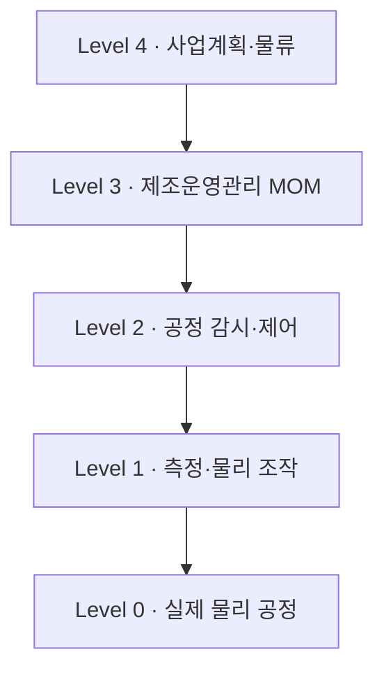

# AI 기반 생산문제 분석 및 공정개선 - 요약본

> [!info] 이 문서의 용도
> 12시간 교재의 핵심만 뽑아 정리한 학습용 요약본입니다. 전문은 [[제조AI-교재-단일]] 참고.
> 영역별 스터디 노트: [[00 - 학습 로드맵]]

> [!tip] 학습 활용법
> - 제목에 `▾`가 있는 접힌 콜아웃은 클릭하면 펼쳐집니다. 면접 질문은 스스로 답한 뒤 펼쳐 보세요.
> - 다이어그램(mermaid)과 수식은 Obsidian에서 자동으로 렌더링됩니다.

## 목차

- [[#1. 한눈에 보는 전체 지도]]
- [[#2. 핵심 교육 철학 5가지]]
- [[#3. 한빛부품 - 공통 사례]]
- [[#4. ISA-95 계층구조]]
- [[#5. 시스템별 핵심 정리]]
- [[#6. 제어계층 (Sensor·Actuator·PLC·DCS)]]
- [[#7. AI 분석과 AI Brain]]
- [[#8. 시스템 통합과 자율생산]]
- [[#9. 실습 방법 (AI 활용 규칙)]]
- [[#10. 최종 프로젝트와 취업 연결]]
- [[#11. 핵심 용어 사전]]
- [[#12. 자기평가 체크리스트]]

---

## 1. 한눈에 보는 전체 지도

주문 하나가 출하까지 가는 길에 문제가 생기면, 어느 활동과 시스템이 그것을 해결하는가?

| 시선 | 봐야 할 것 |
| :--- | :--- |
| 수직 (계층) | ISA-95 Level 0~4 — 물리공정 / 제어 / 감시 / 운영 / 경영 |
| 수평 (흐름) | 주문→출하를 따라가는 제품·데이터 흐름 |
| 연결 (키) | order_id · work_order_id · material_lot · equipment_id |

---

## 2. 핵심 교육 철학 5가지

1. 약어를 외우는 대신 "고객 주문이 들어와 제품이 출하될 때까지 어떤 문제를 어느 활동과 시스템이 해결하는가?"를 따라간다.
2. ISA-95 계층을 ERP/MES 같은 소프트웨어 이름과 일대일로 고정하지 않는다.
3. AI 답변은 그대로 복사하지 않고 사실·가정·추가 확인사항을 분리해 자신의 설명으로 재구성한다.
4. 가상의 한빛부품, 강사 경험, 공개 실제 사례를 명확히 구분한다.
5. 취업에서는 용어보다 문제·데이터·시스템·사람·조치·성과지표를 연결해 설명하는 능력을 평가한다.

> [!tip] 기억할 한 문장
> 스마트제조 직무에서는 약어를 많이 아는 것보다 "문제 → 데이터 → 시스템 → 사람 → 조치 → 지표"를 연결하는 능력이 더 중요하다.

---

## 3. 한빛부품 - 공통 사례

### 3.1 공정 흐름과 시스템

| 공정 | 핵심 업무 | 대표 시스템 | 주요 데이터 |
| :--- | :--- | :--- | :--- |
| 고객 주문 | 수량·납기 접수 | ERP/SCM | order_id, 요구납기 |
| 자재 입고 | 로트·위치·품질상태 확인 | ERP/WMS/QMS | material_lot, 위치, 상태 |
| 가공 | 절삭·성형·실적 | PLC/MES/POP | 수량·시간·정지·설비 |
| 세척 | 조건 적용·완료 확인 | MES/현장제어 | 시간·농도·온도 |
| 열처리 | 온도·유량 제어 이력 | DCS/MES | 온도·유량 추이·알람 |
| 검사 | 측정·판정·부적합 | QMS/MES | 측정값·판정·불량코드 |
| 포장 | 라벨·포장수량 | PLC/WMS | 완제품로트·라벨 |
| 출하 | 출고·납품·매출 | WMS/ERP | 출하수량·매출실적 |

### 3.2 일곱 문제와 해결방향

| 문제 | 현장 모습 | 해결 방향 | 대표 KPI |
| :--- | :--- | :--- | :--- |
| 납기 확인 지연 | 여러 부서에 전화 후 답변 | 주문·가용재고·구매예정·부하 연결 | 납기 응답시간, 준수율 |
| 구 도면 사용 | A판이 남아 B판 생산에 혼용 | PLM 최신판·적용로트를 MES/QMS에 반영 | 구도면 건수, 반영시간 |
| 종이 실적 | 작업일보 후 엑셀 재입력 | PLC/POP 자동수집 + 사람입력 + MES 확정 | 입력지연, 누락·중복률 |
| 불량 추적 곤란 | 자재·설비·조건을 한 번에 못 찾음 | lot-work order-equipment-result 연결 | 추적시간, 성공률 |
| 고장 후 정비 | 멈춘 뒤에 점검·부품검색 | 상태감시 + CMMS 작업지시·이력 | 비계획정지, MTTR[^1] |
| 재고 활용 곤란 | 수량은 있지만 위치·상태·예약 불명 | WMS/QMS/ERP/MES 상태 공유 | 재고정확도, 피킹시간 |
| 보고서 장시간 | 파일 수작업 병합 | 공통 기준정보·자동집계 + 사람 해석 | 작성시간, 수정횟수 |

> [!note] 강사 해설 핵심
> ==정답은 하나가 아니다==. "문제가 크다"는 주장보다 업무 영향(납기·품질·정지·재고)과 데이터 확보 가능성으로 우선순위를 설명하는 것이 중요하다.

---

## 4. ISA-95 계층구조

### 4.1 Level 0~4

| Level | 무엇을 다루는가 | 한빛부품 예시 | 시간범위 |
| :--- | :--- | :--- | :--- |
| 4 | 사업계획·물류·전사자원 | 고객주문, 납기, 구매, 재고, 원가 | 일~주~월 |
| 3 | 제조운영관리(MOM) | 작업지시, 일정, 품질, 정비, 재고운영 | 분~시간~교대 |
| 2 | 공정 감시·제어 | 열처리 온도제어, 설비 상태감시 | 초~분 |
| 1 | 측정·물리 조작 | 센서 측정, 밸브·모터 작동 | ms~초 |
| 0 | 실제 물리적 공정 | 절삭, 세척, 가열, 포장 | 물리현상 |

계획·기준 정보는 위에서 아래로, 실적·상태 정보는 아래에서 위로 움직인다.

### 4.2 주문→출하 관통

| 단계 | 주요 Level | 핵심 데이터 |
| :--- | :--- | :--- |
| 주문·납기 | 4 | order_id, product_id, qty, due_date |
| 설계기준 | 4~3 | revision, BOM, effectivity |
| 구매·입고 | 4~3 | PO, material_lot, location, status |
| 계획·작업지시 | 3 | work_order_id, routing, equipment |
| 공정실행 | 2~0 | timestamp, tag, value, alarm |
| 검사 | 3 | inspection_id, result, defect_code |
| 포장·출하 | 3~4 | finished_lot, shipment_id |

> [!warning] 중요한 오개념 교정
> "ERP=Level 4, MES=Level 3, PLC=Level 2"라고 외우면 실제 프로젝트에서 문제가 생긴다. ISA-95는 활동과 정보교환의 논리적 틀이다. 제품 하나가 여러 레벨의 업무를 지원할 수 있다.

### 4.3 핵심 식별키 (추적성 연결축)

`order_id → work_order_id → material_lot → equipment_id → inspection_id → finished_lot → shipment_id`

각 키의 생성 시점·연결 업무·잘못 연결 시 문제를 설명할 수 있어야 한다.

---

## 5. 시스템별 핵심 정리

### 5.1 ERP와 SCM

| 구분 | ERP | SCM |
| :--- | :--- | :--- |
| 초점 | 내부 자원 관리 | 공급망 계획·조정 |
| 대표 질문 | 주문·구매·재고·원가를 어떻게 관리하는가 | 공급부터 납품까지 어떻게 연결하는가 |

**전산재고와 사용가능재고는 다르다**: 사용가능 = on_hand − quality_hold − reserved

**ATP(Available-to-Promise, 납기약속가능수량) 계산 예 (수업 데이터)**

$$
\text{사용가능} = 1{,}200 - 200 - 100 = 900 \qquad \text{부족} = 1{,}000 - 900 = 100
$$

단, ==이 계산만으로 납품일을 확정하면 안 된다==. 공급일·설비 가용시간·리드타임·검사·포장·운송 조건이 더 필요하다.

**최소 데이터 객체**: Item / Inventory(on_hand, quality_hold, reserved) / Sales Order / Purchase·Supply / Production Request

> [!question]- 면접 질문 — 재고가 충분한데도 납기를 못 약속하는 이유는?
> 품질상태·예약·공급예정·설비능력·리드타임·검사·운송까지 확인해야 한다.

### 5.2 PLM

| 개념 | 학생용 설명 | 한빛부품 질문 |
| :--- | :--- | :--- |
| Revision | 도면/설계의 유효한 판 | 현재 생산에 유효한 A/B판은? |
| BOM | 무엇으로 구성되는가 | 새 소재규격이 어느 부품에? |
| Routing/BOP | 어떤 공정으로 만드는가 | 변경으로 공정이 달라지는가? |
| Effectivity | 언제/어느 로트부터 적용 | B판은 어느 주문·로트부터? |

**A→B판 변경 시**: PLM(변경사유·승인·Effectivity) → ERP/SCM(구매규격·발주·재고) → MES(적용 로트·작업지시) → QMS(검사기준·공차) + 기존 자재·재공품 처리는 승인된 처리(사용/특채/재작업/반품/폐기)를 선택.

> [!tip] 면접 한 문장
> "설계변경은 새 도면 배포로 끝나지 않고, 승인·적용범위·기존 자재/재공품 처리·생산지시·검사기준이 함께 변경되어야 합니다."

### 5.3 MES와 POP

**MOM 7가지 기능**: Definition(무엇을 어떻게) / Resource(무엇으로) / Scheduling(언제) / Dispatch(지금 무엇을) / Collection(무슨 일이) / Tracking(어떤 로트·설비) / Performance(계획 대비)

**Work Order 상태**: Created → Released → Started → Running/Hold → Completed → Closed

**POP**: 현장 데이터 수집 접점. 자동수집(PLC/센서: 수량·시간·정지)과 사람입력(사유·확인·판정)을 구분.

> [!warning] 누적 카운터 500 증가 ≠ 양품 500
> ① 시험가동 수량 혼입 ② 재작업품 재카운트 ③ 불량/양품 미구분 ④ 카운터 리셋 ⑤ work_order_id 미연결 — ==수집과 실적 확정은 다르다==. MES가 검증 후 확정한다.

### 5.4 QMS

**품질문제 대응 6단계**: ① 기준 확인(revision) → ② 측정 신뢰성(gauge·calibration) → ③ 부적합 통제(격리) → ④ 추적(lot·설비·조건) → ⑤ 원인 검증(가설→데이터) → ⑥ 시정·효과(재발률)

**사실 vs 가설 분리 예**
- 확인된 사실: 측정값 공차 초과 / lot L2401 / 설비 M03 / B판 적용
- 원인 가설: 공구마모, 소재편차, 측정기 이상, 작업조건 차이, 고정구 문제
- 추가 확인: 공구수명, 소재성적, 교정 이력, 제품Mix, 속도, 표본수

> [!question]- 면접 질문 — 특정 설비의 불량률이 높다는 상관관계를 발견했을 때 확인할 것?
> 표본수·제품Mix·측정기·작업조건 등 교란 요인과 인과 검증 방법을 먼저 확인한다.

### 5.5 CMMS

**이상→정비 완료 7단계**: 이상 감지(센서/AI) → 유효성 확인(센서오류·조건변화) → 점검 요청 → 작업지시(담당·부품·허가) → 일정 조정(생산과 합의) → 수행·완료(교체부품 기록) → 효과 확인(진동/정지 추이)

**정비전략 4종**: 사후정비 / 예방정비(주기) / 상태기반정비(임계·추세) / 예지정비(모델 예측, 검증 필요)

> [!note] 역할 경계
> 센서·AI는 이상탐지까지, CMMS는 정비업무 관리까지. 진동 증가만으로 특정 부품 고장을 확정하지 않는다.

### 5.6 WMS

**재고를 보는 4개의 질문**

| 질문 | 필드 | 문제가 생기면 |
| :--- | :--- | :--- |
| 얼마나 있는가? | qty_on_hand | 수량부족/과잉 |
| 어디에 있는가? | location_id | 피킹 지연·분실 |
| 쓸 수 있는가? | quality_status | 보류품 오투입 |
| 누가 쓰기로 했는가? | reserved_order | 이중할당·납기충돌 |

**이벤트마다 정보 갱신**: 입고→품질검사→Put-away→예약→피킹→생산투입→반품. 하나라도 빠지면 유령재고·추적성 단절.

> [!tip] 면접 한 문장
> 바코드/RFID 자체가 재고정확도를 보장하지 않는다. 업무 이벤트마다 정보가 정확히 갱신되는 것이 더 중요하다.

---

## 6. 제어계층 (Sensor·Actuator·PLC·DCS)

| 관점 | PLC | DCS |
| :--- | :--- | :--- |
| 주요 사용 | 기계·라인·순차/인터록/모션 | 연속공정·다수 제어루프·운전감시 |
| 한빛부품 가정 | 가공기·포장기 | 열처리·유틸리티 |
| 선정기준 | 응답성, I/O 구조 | 운전통합, 알람/이력 |

> [!warning] "PLC는 단순, DCS는 복잡"은 틀린 설명
> 공정특성·규모·운전방식으로 비교해야 한다. 현대 제품은 기능이 중첩된다.

**안전 경계**: AI는 절감·조건 변경을 "제안"할 수 있지만, 실제 제어는 승인된 제어로직·작업자 권한·인터록·안전기능을 우회하지 않는 범위에서만.

---

## 7. AI 분석과 AI Brain

### 7.1 불량률 계산 (수업 데이터 검산)

| 구분 | 생산 | 불량 | 불량률 |
| :--- | :--- | :--- | :--- |
| 개선 전 A | 200 | 8 | 4.00% |
| 개선 전 B | 100 | 6 | 6.00% |
| 개선 후 A | 200 | 4 | 2.00% |
| 개선 후 B | 100 | 3 | 3.00% |

$$
\text{개선 전} \quad \frac{14}{300} \approx 4.67\% \qquad \text{개선 후} \quad \frac{7}{300} \approx 2.33\%
$$

- 감소 폭 ≈ 2.34%p[^2], 상대 감소율 ≈ 50%
- 제품별 비율을 단순 평균하지 말 것 (수량 기준으로 계산)
- ==관측된 차이이며 인과효과가 자동 입증된 것이 아님==

### 7.2 AI Brain 데이터 3층

| 층 | 대표 데이터 | AI 활용 |
| :--- | :--- | :--- |
| RDB | 주문, 작업지시, 자재로트, 검사, 정비 | 조회, 집계, 추적 |
| TSDB/Historian | 온도, 진동, 유량, 설비상태 | 추세, 이상탐지, 예측 |
| 문서/RAG | 작업표준, 품질기준, 매뉴얼 | 검색, 근거제시 |
| Rule/Knowledge | 전문가 규칙 (품질보류 금지 등) | 경고, 의사결정 보조 |

**가장 중요한 연결키**: work_order_id / material_lot / equipment_id / timestamp / revision
→ TSDB 센서값 + RDB 업무데이터를 같은 시간·식별자로 연결. 센서값만 많으면 AI Brain이 아니다.

### 7.3 5W1H 보고 템플릿

What(무슨 이상) / Where(어느 설비·로트) / When(언제부터) / Why(근거 있는 원인 후보) / Who(누가 확인·승인) / How(다음 행동과 검증방법)

---

## 8. 시스템 통합과 자율생산

### 8.1 치수불량 통합 대응 8단계

| 단계 | 필요 데이터 | 관련 시스템 | 사람/AI |
| :--- | :--- | :--- | :--- |
| 1 이상 인지 | 불량률·측정값·lot | QMS/MES | AI 요약, 품질담당 확인 |
| 2 영향범위 격리 | lot·inventory status | QMS/WMS | 담당자 격리 승인 |
| 3 기준 확인 | revision·검사규격 | PLM/QMS | 최신 기준 검증 |
| 4 공정 추적 | work order·설비·조건 | MES/POP/PLC-DCS | AI 상관·패턴 탐색 |
| 5 설비 이력 | alarm·진동·정비 | CMMS/TSDB | 정비가설·점검 |
| 6 조치 결정 | 납기·재고·대체설비 | ERP/SCM/MES | 사람이 승인 |
| 7 실행 | 재검·재작업·정비·조건조정 | QMS/MES/CMMS | 권한 내 실행 |
| 8 효과 검증 | 다음 lot 품질·설비상태 | QMS/MES/TSDB | 성과확인, 필요시 복귀 |

핵심: 모든 시스템을 직렬로 연결하지 않는다. ==정보는 병렬로 공유된다==.

### 8.2 자율생산 성숙도 5단계

① 수작업 중심 → ② 디지털 기록 → ③ 규칙 기반 자동화 → ④ AI 판단 지원 → ⑤ 검증된 범위 자율운영

> [!note] 자율생산의 정의
> ==완전 무인화가 아니라== 승인된 목표·규칙·권한·안전범위 안에서 감지→판단→실행→검증→복귀가 반복되는 운영이다. (Human-in-the-loop)

---

## 9. 실습 방법 (AI 활용 규칙)

### 9.1 프롬프트 5요소

| 요소 | 질문에 넣을 내용 | 한빛부품 예시 |
| :--- | :--- | :--- |
| 목적 | 무엇을 판단/만들 것인가 | 납기 확정에 필요한 정보 정리 |
| 상황/맥락 | 공정·문제·현재 데이터 | 주문 1,000개, 재고 1,200개, 보류 200개 |
| 제공자료 | 표·수치·규칙·정의 | 보류와 예약은 중복되지 않음 |
| 제약 | 하지 말아야 할 추정·범위 | 납품일을 임의로 정하지 말 것 |
| 출력형식 | 표, 단계, 필드, 체크리스트 | 계산 → 추가정보 → 비교 표 |

### 9.2 AI 답변 검토 6문항

1. 개념이 정확한가? (ISA-95 Level 3을 MES 제품 하나와 동일시하지 않았는가?)
2. 한빛부품 사례에 맞는가?
3. 제공되지 않은 사실·수치·성과를 만들지 않았는가?
4. 판단에 필요한 정보가 빠지지 않았는가?
5. 확인된 사실과 원인 가설을 구분했는가?
6. 자신의 말로 설명할 수 있을 만큼 단순·구조화되었는가?

### 9.3 공통 시스템 지시문 (핵심 규칙 요약)

- 첫 문장은 쉬운 설명으로 / 약어는 첫 등장 시 정식 명칭과 의미를 함께
- ISA-95 활동 계층과 ERP/MES 제품명을 혼동하지 않기
- 표준 개념·수업용 가정·회사별 구현 차이 구분
- 제공되지 않은 수치·성과 창작 금지 / AI 제안을 확정 원인·검증된 성과로 표현 금지
- 사실/가정/원인 가설/추가 확인사항 구분
- 출력은 짧은 설명 + 표 중심, 마지막에 확인 질문 1개
- 실제 기업 비공개 데이터·안전제어 코드 요구 금지

> [!warning] 자주 하는 실수
> "개선율 30% 향상" 같은 근거 없는 수치 만들기, "~하면 해결됩니다"라는 확정 표현, 시스템 이름만 나열하고 업무를 설명하지 못하기.

---

## 10. 최종 프로젝트와 취업 연결

### 10.1 팀 프로젝트 산출물 7종

1. 문제정의 — 누구의 어떤 업무가 왜 어려운가
2. As-Is 흐름 — 전화·종이·엑셀·시스템이 어떻게 연결되어 있는가
3. 필요 데이터 — 최소 8개 필드와 데이터 원천
4. 관련 시스템 — 역할과 주고받는 정보
5. AI 활용 — 요약·분석·추천·검색 중 어디에 쓰는가
6. 사람의 승인·안전·보안 — 누가 최종 책임지는가
7. 성과 검증 — KPI 정의·기준선·측정기간·비교조건

### 10.2 평가 루브릭 (100점)

| 항목 | 배점 | 우수 기준 |
| :--- | :--- | :--- |
| 문제 정의 | 15 | 대상 업무·사용자·영향이 구체적 |
| ISA-95/시스템 역할 | 15 | 제품명이 아니라 활동·책임으로 설명 |
| 데이터 설계 | 20 | 필드·원천·연결키·품질검증 구체적 |
| AI 활용 | 15 | 지원 역할과 한계·검증이 명확 |
| 사람/권한/안전 | 10 | 승인점·책임·보안 포함 |
| 개선 실행안 | 10 | 조치 흐름이 실제 업무와 연결 |
| KPI 검증 | 10 | 정의·기준선·기간·비교조건 제시 |
| 발표/문서화 | 5 | 3분 내 논리적으로 설명 |

### 10.3 면접 핵심 질문 12개 (스스로 답해보기)

> [!question]- 클릭해서 펼치기 — 면접 핵심 질문 12개
> 1. ISA-95 Level 3을 MES와 동일시하면 왜 부족한가?
> 2. ERP의 on-hand 재고와 사용가능재고는 어떻게 다른가?
> 3. PLM의 Revision과 Effectivity가 왜 생산현장에 중요한가?
> 4. PLC 누적 카운터가 늘었다고 양품실적이 자동 확정되지 않는 이유는?
> 5. 불량 추적성에서 가장 중요한 식별키는 무엇이며 왜인가?
> 6. QMS에서 상관관계와 원인확정을 어떻게 구분하는가?
> 7. AI 이상탐지와 CMMS의 역할 차이는?
> 8. 바코드/RFID 도입만으로 재고정확도가 보장되지 않는 이유는?
> 9. PLC와 DCS의 차이를 "단순/복잡"이 아닌 관점에서 설명하면?
> 10. RDB와 TSDB를 제조 AI에서 각각 어디에 사용하는가?
> 11. 자율생산에서 Human-in-the-loop가 필요한 이유는?
> 12. AI 답변에서 근거 없는 수치를 발견했을 때 어떻게 처리하는가?

### 10.4 면접 답변 6단계 프레임

| 순서 | 프레임 | 예 |
| :--- | :--- | :--- |
| 1 | 문제 상황 | 최종검사 치수불량 증가 |
| 2 | 확인 데이터 | lot, 도면판, 설비, 공정조건, 측정값 |
| 3 | 시스템/담당자 | QMS 중심, PLM·MES·WMS·CMMS 연계 |
| 4 | 사실/가설 | 불량 증가=사실, 공구마모=가설 |
| 5 | 개선/승인 | 격리→원인검증→재작업/정비→승인 |
| 6 | 성과/한계 | 재발률·추적시간 측정, 실데이터 검증 필요 |

### 10.5 3분 발표 스크립트

> [!quote] 3분 스크립트
> ① 저는 한빛부품의 [문제]를 선택했습니다. ② 현재는 [업무단절] 때문에 [영향]이 발생합니다. ③ 필요한 데이터는 [키 데이터]입니다. ④ [시스템]은 각각 [역할]을 합니다. ⑤ AI는 [지원]에 사용하지만 [승인/검증]은 사람이 합니다. ⑥ 효과는 [KPI]로 [기간/기준]에 따라 검증하겠습니다.

---

## 11. 핵심 용어 사전

| 용어 | 정식 명칭 | 기억할 질문 |
| :--- | :--- | :--- |
| ERP | Enterprise Resource Planning | 주문·구매·재고·원가 등 자원을 어떻게 관리하는가? |
| SCM | Supply Chain Management | 공급부터 납품까지 어떻게 연결·조정하는가? |
| PLM | Product Lifecycle Management | 무엇을 어떤 설계·판으로 만들 것인가? |
| MES | Manufacturing Execution System | 현장에서 무엇을 언제 어떻게 생산하는가? |
| MOM | Manufacturing Operations Management | 생산·품질·정비·재고 운영활동을 어떻게 관리하는가? |
| POP | Point of Production | 작업·실적·정지 정보를 현장에서 어떻게 수집하는가? |
| QMS | Quality Management System | 품질기준·부적합·재발을 어떻게 관리하는가? |
| CMMS | Computerized Maintenance Management System | 설비를 언제 어떻게 정비하고 이력을 남기는가? |
| WMS | Warehouse Management System | 무엇이 어디에 어떤 상태로 누구에게 예약됐는가? |
| PLC | Programmable Logic Controller | 기계·라인의 로직과 동작을 어떻게 제어하는가? |
| DCS | Distributed Control System | 여러 제어루프와 운전·감시를 어떻게 통합하는가? |
| ATP | Available-to-Promise | 지금 정보로 약속 가능한 수량/납기를 어떻게 판단하는가? |
| RDB | Relational Database | 주문·작업지시·검사 같은 업무데이터 저장 |
| TSDB | Time Series Database | 시간에 따른 센서·상태 데이터 저장 |
| RAG | Retrieval-Augmented Generation | 표준서·매뉴얼을 찾아 AI 답변에 연결 |
| Traceability | 추적성 | 어떤 자재·작업·설비·조건·검사를 거쳤는가? |

---

## 12. 자기평가 체크리스트

> [!todo] 자기평가 체크리스트
> - [ ] 나는 한빛부품의 주문→출하를 3분 안에 설명할 수 있다.
> - [ ] 나는 각 시스템의 기능을 제품명이 아니라 업무 기준으로 설명할 수 있다.
> - [ ] 나는 문제 하나를 위해 필요한 데이터를 최소 8개 필드로 정의할 수 있다.
> - [ ] 나는 AI 답변의 사실과 가설을 분리할 수 있다.
> - [ ] 나는 KPI에 데이터 원천과 측정기간을 붙여 설명할 수 있다.
> - [ ] 나는 "AI가 해줍니다"가 아니라 사람의 승인·검증 역할을 말할 수 있다.

> [!quote] 마지막으로 기억할 문장
> 스마트제조 직무에서는 약어를 많이 아는 것보다 "문제 → 데이터 → 시스템 → 사람 → 조치 → 지표"를 연결하여 설명할 수 있는 능력이 더 중요하다. 생성형 AI는 그 사고를 빠르게 확장하고 검토하는 도구이며, 최종 판단과 책임을 대신하지 않는다.

[^1]: MTTR = Mean Time To Repair. 설비 고장 발생 후 복구 완료까지 걸린 평균 시간.
[^2]: %p = 퍼센트 포인트. 4.67%에서 2.33%로 가면 2.34%p 감소이며, 상대 감소율(약 50%)과 구분해서 말해야 한다.
